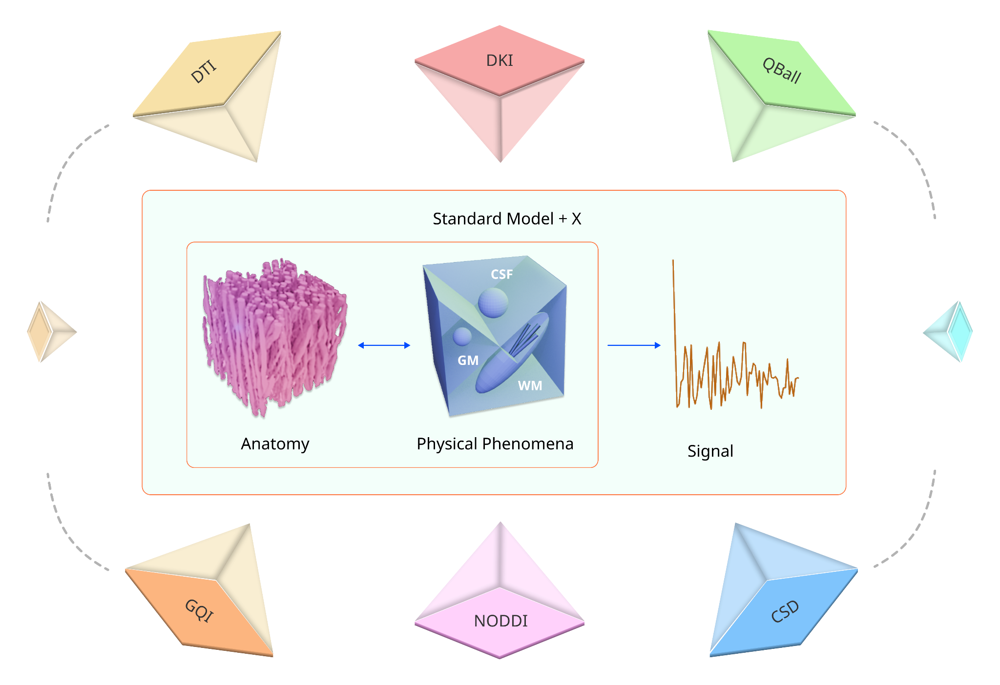
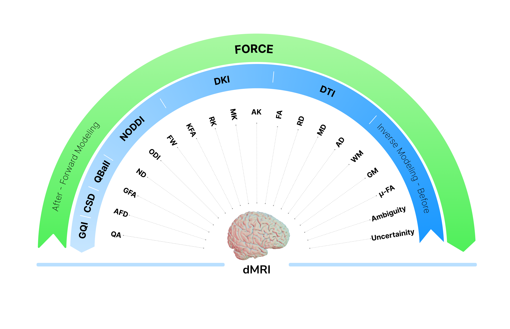

# FORCE: FORward modeling for Complex microstructure Estimation

| FORCE Concept | FORCE Capabilities |
| --- | --- |
|  |  |

| HCP DTI | HCP DKI | HCP AMICO |
| --- | --- | --- |
|  |  |  |

---

## Introduction

FORCE is a novel framework for diffusion MRI analysis that builds a vast number of simulated diffusion signals and matches real data to this library to obtain fiber orientations and microstructural maps.

The pipeline provides:
- **Multi-fiber tractography peaks** from a single matching step
- **NODDI-like metrics** (neurite density, orientation dispersion, CSF fraction)
- **DTI & DKI metrics** (FA, MD, RD, AD)
- **Tissue fraction maps** (white matter, gray matter, CSF)
- **Uncertainty and ambiguity measures** for quality assessment

The FORCE method is described in the associated preprint:

> FORCE: FORward modeling for Complex microstructure Estimation  
> https://www.researchsquare.com/article/rs-8151109/v1

---

## Quick Start with Demo

### 1. Install Dependencies

First, install all required Python packages:

```bash
pip install -r requirements.txt
```

### 2. Run the Demo Notebook

The easiest way to get started is to run `demo.ipynb`, which automatically fetches the **Stanford HARDI dataset** from DIPY and demonstrates the complete FORCE pipeline:

```bash
jupyter notebook demo.ipynb
```

The demo will:
1. Download the Stanford HARDI dataset (if not already cached)
2. Preprocess the data (denoising and masking)
3. Generate the simulation library
4. Match real data to simulations using FAISS
5. Visualize tissue fractions, NODDI metrics, DTI metrics, and uncertainty maps

---

## Using Your Own Data

For running FORCE on your own diffusion MRI data, use the standalone scripts:

### 1. Simulation (`simulation.py`)

Edit the paths at the top of `simulation.py`:

```python
bval_path = "/path/to/your/bvals"
bvec_path = "/path/to/your/bvecs"
output_dir = "/path/to/output/directory"
```

Then run:

```bash
python simulation.py
```

This generates `simulated_data.npz` containing the simulation library matched to your acquisition protocol.

### 2. Matching (`matching.py`)

Edit the paths at the top of `matching.py`:

```python
bval_path = "/path/to/your/bvals"
bvec_path = "/path/to/your/bvecs"
data_path = "/path/to/your/preprocessed_dwi.nii.gz"
mask_path = "/path/to/your/brain_mask.nii.gz"
sims_dir = "/path/to/simulated_data"  # folder containing simulated_data.npz
output_dir = "/path/to/output/directory"
```

Then run:

```bash
python matching.py
```

This produces ODFs, peaks, and all microstructural maps as NIfTI files.

---

## Repository Structure

| File | Description |
| --- | --- |
| `demo.ipynb` | Interactive notebook demonstrating the full pipeline on Stanford HARDI data |
| `simulation.py` | Generates simulated diffusion signals library |
| `matching.py` | Matches real data to simulations |
| `faster_multitensor.pyx` | Cython extension for fast multi-tensor signal generation |
| `vector_search.pyx` | Cython extension for vector similarity search |
| `setup_fast.py` | Builds the Cython extensions |
| `utils/` | Helper modules for geometry, distributions, and analytical computations |

---

## Requirements

- **Python**: 3.8 or newer

All dependencies are listed in `requirements.txt` and can be installed with a single command:

```bash
pip install -r requirements.txt
```
